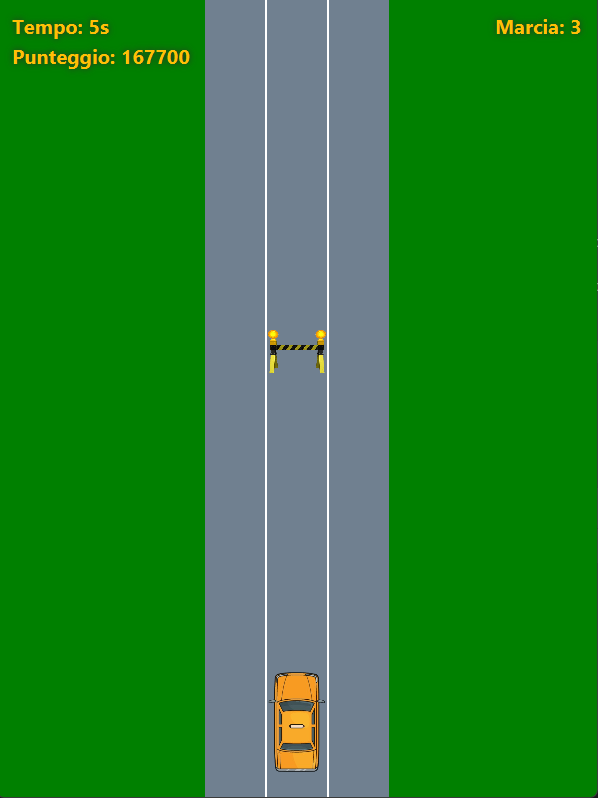
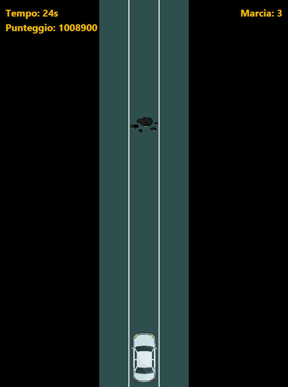
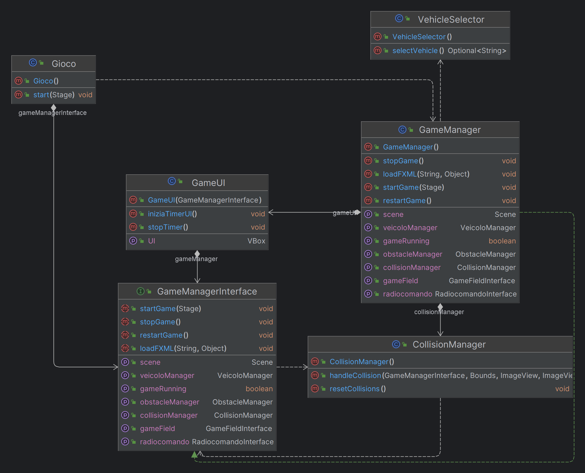
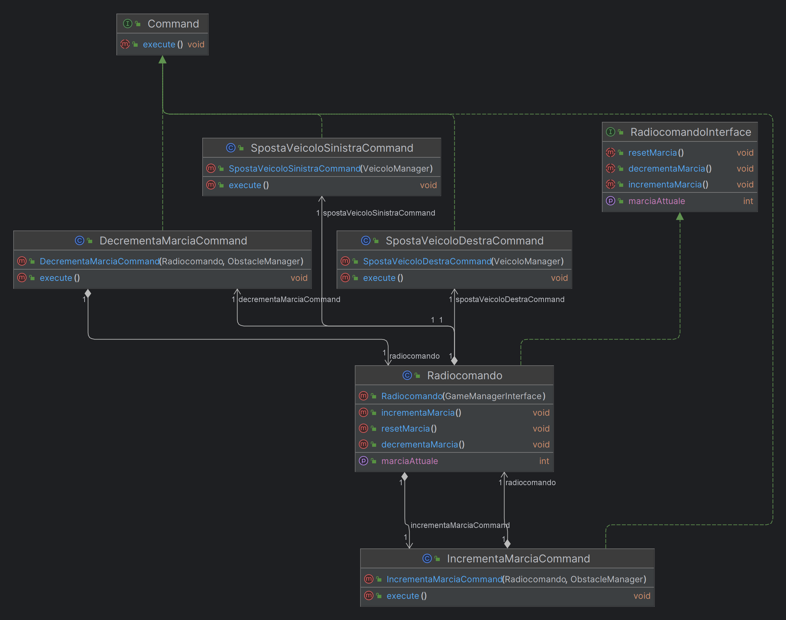
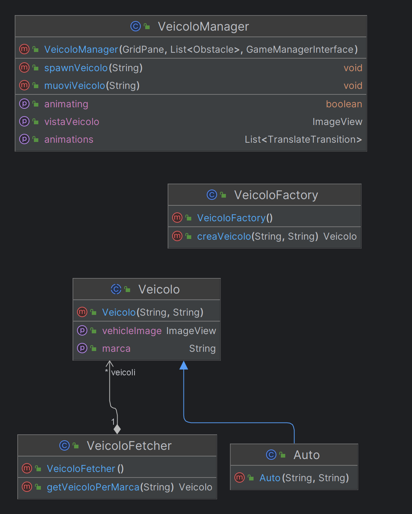
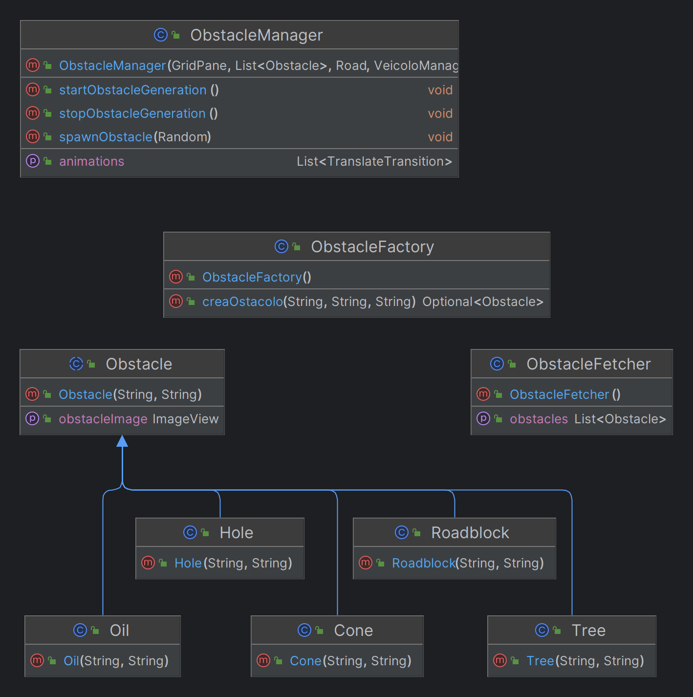
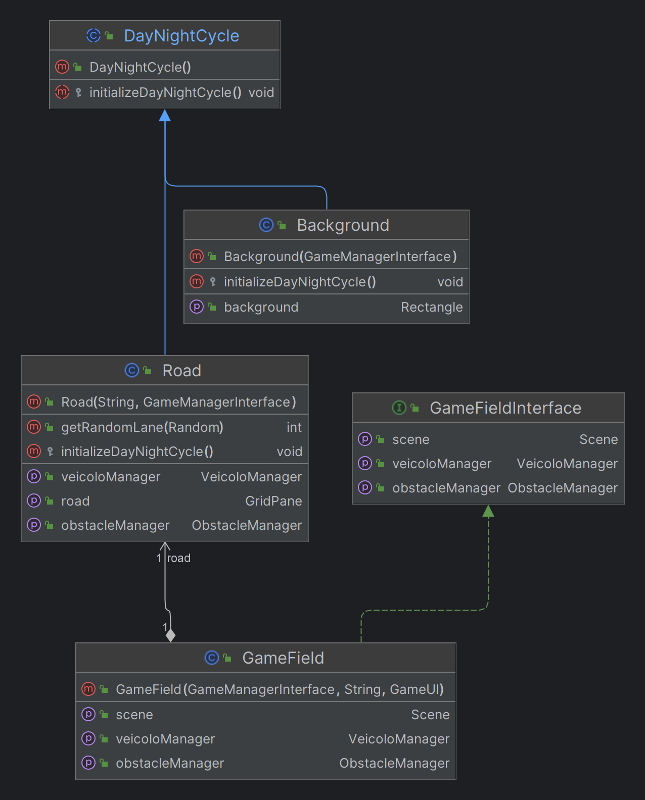

# Introduzione

Veicolo Radiocomandato è un progetto universitario di Programmazione 3 che consiste in un gioco di macchinine
radiocomandate sviluppato su JavaFX con Gradle.

## Traccia

    Si vuole sviluppare un’applicazione per la gestione di un veicolo radiocomandato (auto, moto, camion, ...).
    Ogni veicolo è identificato da un codice, tipo veicolo, marca e frequenza di funzionamento.

    Il radiocomando ha i seguenti comandi:

    - Manubrio;
    - Acceleratore;
    - Marce;
    - Freno;
    - Manopola per la scelta del tipo di veicolo.

    Il veicolo:
    
    - È dotato di luci anteriori e posteriori e un sensore crepuscolare che permette
    automaticamente di accendere le luci in condizioni di luce bassa.
    
    - Prevede due sensori di prossimità sul lato anteriore che permettono di accendere
    delle luci sul radiocomando per avvertire dell’ostacolo a destra o a sinistra del veicolo.
    
    - È dotato di una telecamera per riconoscere oggetti. In prossimità di un ostacolo
    scatta una foto e chiede all’utente l’associazione di un nome.
    Al successivo passaggio vicino all’ostacolo comunica all’utente il nome che gli è stato associato.

    Sviluppare l’applicazione per la gestione di veicoli radiocomandati prevedendo le opportune interfacce.

## Note di sviluppo:

    La prova d’esame richiede la progettazione e lo sviluppo della traccia proposta.
    Lo studente può scegliere di sviluppare il progetto nelle due modalità: Applicazione Web o programma standalone con supporto grafico.

    Il progetto deve essere sviluppato secondo le seguenti linee:

    - Usare almeno due pattern tra i design pattern noti;

    - Attenersi ai principi della programmazione SOLID;

    - Usare il linguaggio Java;

    - Inserire sufficienti commenti (anche per Javadoc) e annotazioni;

    - Gestione delle eccezioni;

    - Usare i file o database;
    
    È possibile costruire l'applicazione standalone con supporto grafico tramite l'utilizzo di strumenti per
    la realizzazione di interfacce grafiche presenti in molti IDE (GUI Designer in IntelliJ e WindowsBuilder in Eclipse)
    oppure utilizzare tools compatibili con JavaFx come Scene Builder (compatibile con gli IDE).

# Gioco

L'obiettivo del gioco è schivare gli ostacoli muovendosi a destra e sinistra con il veicolo selezionato per raggiungere
un punteggio alto.

Vi sono tre elementi UI principali:

- Timer: Un orologio che tiene conto della durata della partita.
- Score: Un numero molto alto indicato per indicare un punteggio.
- Marcia: La marcia attuale utilizzata.

Il gioco è dotato di:

- Una meccanica di selezione del veicolo, che include tre macchine di colori diversi (rosso, bianco, giallo).
- Un sistema giorno-notte che permette il cambio di colore dello sfondo e della strada.
- Una generazione di fino a cinque ostacoli diversi.
- Un sistema di marce sviluppato per modificare la velocità di movimento del veicolo, così come la velocità di
  generazione e di movimento degli ostacoli.
- Un implementazione di collisioni, Game Over e Restart sufficientemente avanzato per consentire una continuità di gioco
  fluida e interattiva.

# Logica di codice

Il codice è architettato per avere una struttura gerarchica di questo tipo:

- Gioco
    - GameManager
        - CollisionManager
        - GameUI
        - VeicoloManager
        - ObstacleManager
        - Radiocomando
        - GameField
            - Background
            - Road

Il codice è diviso in package per suddividere il ruolo di ciascuna parte del codice.

## Gioco

Il package di Gioco contiene:

- Gioco
- GameManager
- GameManagerInterface
- GameUI
- CollisionManager
- VehicleSelector

## Radiocomando

Il package di Radiocomando contiene:

- Radiocomando
- RadiocomandoInterface
- Command
    - IncrementaMarciaCommand
    - DecrementaMarciaCommand
    - SpostaVeicoloSinistraCommand
    - SpostaVeicoloDestraCommand

## Vehicle

Il package di Vehicle contiene:

- Veicolo
- VeicoloManager
- VeicoloFetcher
- VeicoloFactory
    - Auto

## Ostacoli

Il package di Ostacoli contiene:

- Obstacle
- ObstacleManager
- ObstacleFetcher
- ObstacleFactory
    - Cone
    - Hole
    - Oil
    - Tree
    - Roadblock

## Scena

Il package di Scena contiene:

- GameField
- GameFieldInterface
- DayNightCycle
- Road
    - RoadController
- Background
    - BackgroundController

# Patterns

I pattern utilizzati sono due:

- Factory Pattern
    - Il Factory Pattern è stato implementato due volte.
        - La prima volta debolmente all'interno del package Veicolo per
          garantire in modo estendibile la creazione di veicoli diversi con caratteristiche diverse.
        - La seconda volta è stato implementato in modo completo nella creazione di diversi ostacoli, ognuno con una
          ImageView diversa.
- Command Pattern
    - Il Command Pattern è stato utilizzato per separare le operazioni effettuate dal radiocomando in istanze differenti
      specializzate.

# Crediti

Progetto sviluppato da Lorenzo Mirabella [0124002515] per l'esame di Reti di Calcolatori dell'anno accademico 2023/2024
dell'università Parthenope (NA) sostenuto con il professor Emanuel Di Nardo.
